CDC Cluster
================
Yifu Yan
2018-5-18

Prepare data for machine learning
---------------------------------

### Cleaning

``` r
dropped <- dataset %>%
    select(-1) %>% #delete column X1
    mutate(year_month_day = ymd(str_c(str_extract(IYEAR,"[0-9]+"),
                           str_extract(IMONTH,"[0-9]+"),
                           str_extract(IDAY,"[0-9]+"),
                           sep = "-"))) %>% # change month day year into a year-month-day format 
    mutate(year=year(year_month_day),
           month = month(year_month_day)) %>% # create year and month as number
    select(-IDAY,-IMONTH,-IYEAR) %>% #drop IDAY,IMONTH,IYEAR 
    mutate(days = as.integer(year_month_day)-as.integer(min(year_month_day))) %>%
    select(-year_month_day)# count days to see trend in time easier
```

### Change encoding

``` r
#change encoding----------
to_categorical <- "(_STATE)|(MARITAL)|(_RACEGR3)|(MSCODE)|(EMPLOY)" # use regular expression later
missing_in_dict <- "(_RACEGR2)|(EMPLOY1)|(BPHIGH4)|(TOLDHI2)"

#function to convert numeric to character
dict_to_cate <- function(x){
    as.character(x)
}
#for those columns which only have value 1,2,7,9 and NA, convert 1 to TRUE, 2 to FALSE and others to NA ----------
dict_to_logical <- function(x){
    my_dict <- c(T,F) %>%
        setNames(c(1,2))
    if(all(unique(x) %in% c(1,2,7,9,NA))){
        return(my_dict[as.character(x)])
    } else {
        return(x)
    }
}

encoded <- dropped %>% 
    select(-matches(missing_in_dict)) %>% #drop some missing columns in data dictionary
    mutate_at(vars(matches(to_categorical)),~as.character(.x)) %>% # convert some columns to categorical
    mutate_all(dict_to_logical) %>%
    select(-DIABETE3) # column has unique values 1,2,3,4,7,9 where it is only supposed to have 1,2,4,9, drop this column
```

### Get complete observations and one-hot encoding

``` r
#get all complete observations ------------
#drop columns that have too many missing values
NA_pct <- map_dbl(encoded,~sum(is.na(.x))/length(.x)) %>% sort(decreasing = T)
drop_cols <- names(NA_pct[NA_pct>0.25])
encode_drop <- encoded %>%
    select(-one_of(drop_cols))

#add index encode_drop-------------------
encode_drop_indexed <- encode_drop %>%
    mutate(index = row_number())

encode_drop_indexed <- encode_drop_indexed[complete.cases(encode_drop_indexed),]

#convert all logical to 1 or 0
final <- encode_drop_indexed %>%
    mutate_if(~is.logical(.x),~as.integer(.x))


#one hot encoding------------
one_hot <- model.matrix(index ~ .,data=final)[,-1] %>% as.data.frame()
my_dim <- dim(one_hot)
```

number of complete observations are: 22732, after one-hont encoding, there are 98 variables.

1.Is there a higher prevalence of chronic conditions in certain states?
=======================================================================

``` r
chronic_conditions <- str_split("CVDINFR4
CVDCRHD4
CVDSTRK3
ASTHMA3
CHCSCNCR
CHCOCNCR
CHCCOPD1
HAVARTH3
ADDEPEV2
CHCKIDNY",pattern="\\\n")[[1]]

condition_rank_list <- list()
graph_list_1 <- list()
for(condition in chronic_conditions){
    current_list <- encode_drop %>%
        group_by(`_STATE`) %>%
        summarise(mean_condition = mean(UQ(rlang::sym(condition)),na.rm = T)) %>%
        arrange(desc(mean_condition)) %>% list()
    names(current_list) <- condition
    condition_rank_list <- append(condition_rank_list,current_list)
    current_graph <- current_list[[1]] %>%
        top_n(10) %>%
        ggplot(aes(x = fct_reorder(`_STATE`,mean_condition),y=mean_condition)) +
        geom_col(fill="skyblue3") +
        coord_flip() +
        labs(x = "_STATE",title = condition) 
        
    graph_list_1 <- append(graph_list_1,list(current_graph))
}
```

Following graphs are various chronic conditions ranked in each states. **The top ones have a higher prevalence.**

    ## [[1]]


    ## 
    ## [[2]]

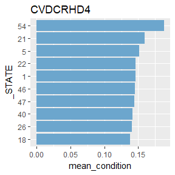

    ## 
    ## [[3]]


    ## 
    ## [[4]]

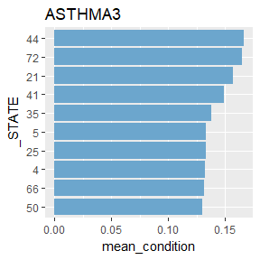

    ## 
    ## [[5]]

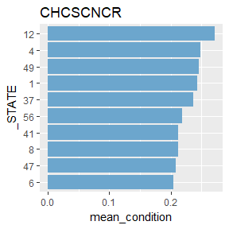

    ## 
    ## [[6]]

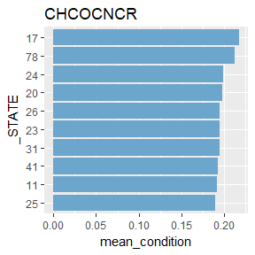

    ## 
    ## [[7]]

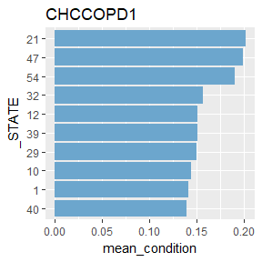

    ## 
    ## [[8]]

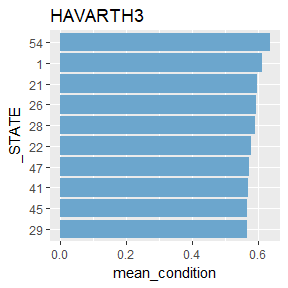

    ## 
    ## [[9]]

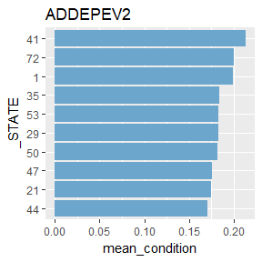

    ## 
    ## [[10]]

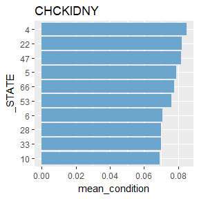

2.Are there there natural clusters of people in this data?
==========================================================

PCA
---

``` r
#PCA---------------------
#rule of thumb, we have 23000 observations, so we use at most 23 variables or it may not converge
normalize_column <- function(x){
    (x-min(x))/(max(x)-min(x))
}
scaled <- map_df(one_hot,normalize_column) #normalize data

pca = princomp(scaled)
out <- capture.output(summary(pca))
out_vec <- str_split(str_c(out[seq(5,length(out),by = 4)],collapse = " "),pattern = " ") 
pca_pct <- out_vec[[1]] %>% as.numeric() %>% na.omit()
pca_table <- tibble(components = seq_along(pca_pct),y=pca_pct)
pca_table %>% 
    ggplot(aes(x = components,y=y)) +
    geom_line() +
    geom_point(color="skyblue3") +
    labs(y="% of Variance explained")
```

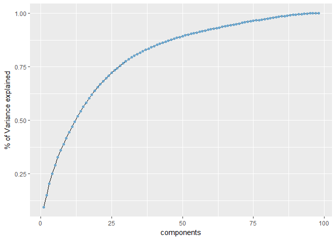

The graph above shows accumulative expalined percentage of variance by each component, we can observe that the first 13 components explained more than 50% variance. So we are going to use them to find important variables.

### Select important variables based on first 13 components

``` r
#Fisrt 13 components explained 52% variance, let's see what makes each components
abs_component_df <- as.data.frame(abs(unclass(pca$loadings)))

#see most influential variables in the first 13 components an calculate their weight
mydf <- abs_component_df[,1:13]
#Sum weight of each variable in first 13 components
important_vars <- apply(map2_df(mydf,13:1,~.x*.y),MARGIN = 1,sum) %>%
    setNames(row.names(abs_component_df)) %>% sort(decreasing = T)
print("importance of all variables:")
```

    ## [1] "importance of all variables:"

``` r
important_vars
```

    ##         SEX    FLUSHOT6    MARITAL3    EXERANY2    HAVARTH3    PNEUVAC3 
    ## 23.33230056 22.94807688 20.57623868 20.03550107 19.95918657 17.32676066 
    ##     MSCODE5    CHCSCNCR    QLACTLM2    DIFFWALK    CHCOCNCR    `_AGE80` 
    ## 15.94566582 14.59863873 14.03437686 12.53014113 11.60290908 10.39101650 
    ##     MSCODE2    ADDEPEV2    CVDCRHD4    CVDINFR4    MARITAL2    MENTHLTH 
    ## 10.28111492 10.16150148  9.10481575  8.87704861  8.72573480  8.07500036 
    ##    PHYSHLTH     MSCODE3    CHCCOPD1    DIFFALON        days        year 
    ##  7.22069951  7.19927203  6.67588464  6.15391804  5.76973120  5.26612434 
    ##     ASTHMA3      DECIDE  `_BMI5CAT`   `_INCOMG`    DIFFDRES       month 
    ##  5.04239436  4.67726434  3.99437433  3.64090173  3.43864808  3.40100443 
    ##    CVDSTRK3 `_RACEGR3`2     GENHLTH    CHCKIDNY   `_EDUCAG`     MEDCOST 
    ##  3.00487662  2.86015564  2.58508792  2.00467554  1.90477938  1.85706393 
    ##    MARITAL5  `_STATE`12  `_STATE`31  `_STATE`24  `_STATE`48  `_STATE`36 
    ##  1.49064237  1.39940792  1.19415990  1.14982220  1.05168448  0.95952790 
    ##    CHECKUP1  `_STATE`53  `_SMOKER3`  `_STATE`25  `_STATE`34  `_STATE`30 
    ##  0.92109616  0.91453129  0.89110167  0.87509287  0.80407271  0.70045568 
    ##  `_STATE`21   `_STATE`9 `_RACEGR3`5  `_STATE`26  `_STATE`56  `_STATE`28 
    ##  0.66383157  0.65126656  0.59901991  0.59846931  0.52332356  0.47686758 
    ## `_RACEGR3`3  `_STATE`38  `_STATE`16   `_STATE`6   `_STATE`8  `_STATE`19 
    ##  0.46814433  0.45272934  0.44717387  0.43552596  0.42531060  0.42118527 
    ##    HLTHPLN1  `_STATE`23  `_STATE`27  `_STATE`44  `_STATE`51  `_STATE`50 
    ##  0.41782419  0.41453437  0.41205626  0.41126331  0.40883413  0.39841927 
    ##  `_STATE`42  `_STATE`20   `_STATE`4  `_STATE`49  `_STATE`22    MARITAL4 
    ##  0.39494957  0.39448078  0.39213675  0.36590522  0.35722889  0.33386563 
    ##  `_STATE`18  `_STATE`45  `_STATE`46  `_STATE`15  `_STATE`35  `_STATE`40 
    ##  0.33064529  0.32378493  0.31738307  0.30595604  0.29842083  0.29280407 
    ## `_RACEGR3`4   `_STATE`5  `_STATE`37  `_STATE`11  `_STATE`17  `_STATE`54 
    ##  0.29208392  0.29145026  0.29041039  0.28756643  0.27840592  0.27034954 
    ##  `_STATE`29   `_STATE`2  `_STATE`39  `_STATE`41  `_STATE`13    MARITAL6 
    ##  0.25871916  0.25642515  0.25555241  0.24625435  0.23761336  0.22697082 
    ##  `_STATE`55  `_STATE`33  `_STATE`47  `_STATE`10 `_RACEGR3`9  `_STATE`32 
    ##  0.21960570  0.21555264  0.19236358  0.18731509  0.16456039  0.14389002 
    ##    MARITAL9     MSCODE4 
    ##  0.09054576  0.06729527

``` r
#Use the first 20 variables
vars_in_cluster <- names(important_vars)[1:20]
```

After PCA, I get the conclusion that the most important 20 variables are(ranked by importantce): SEX, FLUSHOT6, MARITAL3, EXERANY2, HAVARTH3, PNEUVAC3, MSCODE5, CHCSCNCR, QLACTLM2, DIFFWALK, CHCOCNCR, `_AGE80`, MSCODE2, ADDEPEV2, CVDCRHD4, CVDINFR4, MARITAL2, MENTHLTH, PHYSHLTH, MSCODE3

kmeans cluster
--------------

After testing, I found taht while there are four clusters, the clustering is optimal.

``` r
model_data <- scaled %>%
    select(one_of(vars_in_cluster))

kmeans_cluster <- kmeans(model_data,centers = 4,nstart = 25)
sspct <- str_c("between_SS / total_SS = ",round(100*(kmeans_cluster$betweenss/kmeans_cluster$totss),2),"%")
```

The clusters have: between\_SS / total\_SS = 19.76%

The size of each clusters are: 4945, 7166, 5391, 5230

3.How do the health characteristics differ between these clusters?
==================================================================

``` r
encode_drop_indexed_grouped <- encode_drop_indexed %>%
    mutate(group_num = kmeans_cluster$cluster)
health_stats <- str_split("GENHLTH
PHYHLTH
MENHLTH
POORHLTH
DIFFWALK
DECIDE
DIFFALON
DIFFDRES
QLACTLM2",pattern="\\\n")[[1]]
```

Health characteristics in group 1 to 4(SEX=1:male):

``` r
encode_drop_indexed_grouped %>%
    group_by(group_num) %>%
    select(one_of(c("SEX",health_stats))) %>%
    summarise_all(~round(mean(.x),2)) %>%
    DT::datatable()
```

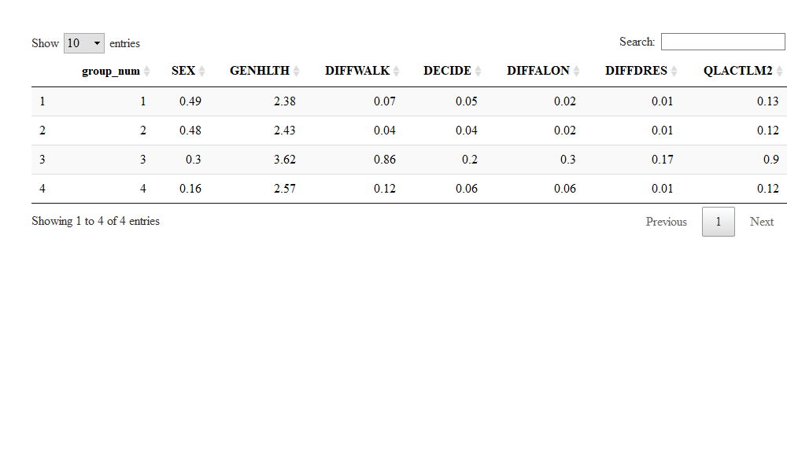

Through the observation, we can find that:

In group 1: They are likely to be female, who think their health is fair. They have serious mental and physical issues. They also have difficulty in awlking and bathing.

In group 2: They are mostly female, they think they have good health condition. Some of them have difficulty in walking and doing errands along.

Group 3 and 4 are similar. Both of the groups think they have good health condition.

4.How do the behavior characteristics differ between these clusters?
====================================================================

``` r
behavior_stats <- str_split("_RFDRHV5
EXERANY2
AVEDRNK2
DRNK3GE5
_SMOKER3
_BMI5CAT
_FRUTSUM
_VEGESUM",pattern="\\\n")[[1]]
```

Behavior characteristics in group 1 to 4(SEX=1:male):

``` r
encode_drop_indexed_grouped %>%
    group_by(group_num) %>%
    select(one_of(c("SEX",behavior_stats))) %>%
    summarise_all(~round(mean(.x),2)) %>%
    DT::datatable()
```

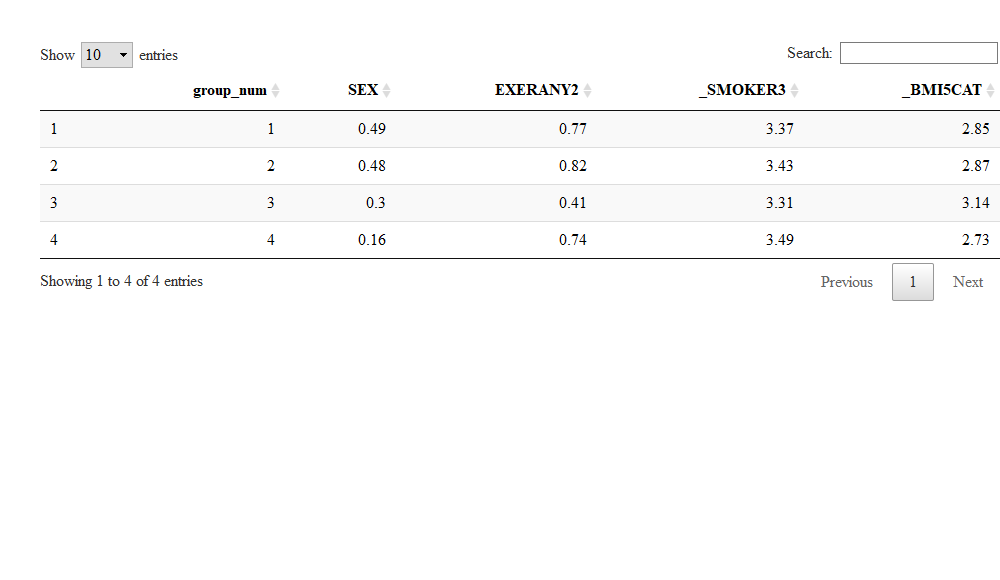

Through the observation, we can find that:

In group one: They seldom do exercises and are very likely to be overweight.

Group 2,3 and 4 are similar in behavior characteristics.

Conclusion
==========

This kmeans cluster successfully identifies group 1 as the most unhealthy groups.

Group 2 have some difficulty in walking and doing errands alng but identify themselves as having good health.

Group 3 and 4 don't have distinct health and behavior characteristics.
